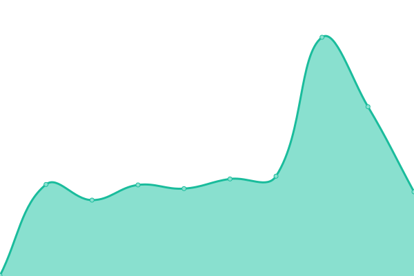

# [📈 Live Status](https://status.atmovantage.com): <!--live status--> **🟩 All systems operational**

This repository contains the open-source uptime monitor and status page for [Austin Shackelford](https://atmovantage.com), powered by [Upptime](https://github.com/upptime/upptime).

With [Upptime](https://upptime.js.org), you can get your own unlimited and free uptime monitor and status page, powered entirely by a GitHub repository. We use [Issues](https://github.com/atmovantage/atmostatus/issues) as incident reports, [Actions](https://github.com/atmovantage/atmostatus/actions) as uptime monitors, and [Pages](https://status.atmovantage.com) for the status page.

<!--start: status pages-->
<!-- This summary is generated by Upptime (https://github.com/upptime/upptime) -->
<!-- Do not edit this manually, your changes will be overwritten -->
<!-- prettier-ignore -->
| URL | Status | History | Response Time | Uptime |
| --- | ------ | ------- | ------------- | ------ |
|  AtmoLive01 Server | 🟩 Up | [atmo-live01-server.yml](https://github.com/atmovantage/atmostatus/commits/HEAD/history/atmo-live01-server.yml) | 

 228ms
     
 | 

<a href="https://status.atmovantage.com/history/atmo-live01-server">100.00%</a>
    

|  AtmoLive06 Server | 🟩 Up | [atmo-live06-server.yml](https://github.com/atmovantage/atmostatus/commits/HEAD/history/atmo-live06-server.yml) | 

 221ms
     
 | 

<a href="https://status.atmovantage.com/history/atmo-live06-server">100.00%</a>
    

|  AtmoLive07 Server | 🟩 Up | [atmo-live07-server.yml](https://github.com/atmovantage/atmostatus/commits/HEAD/history/atmo-live07-server.yml) | 

 212ms
     
 | 

<a href="https://status.atmovantage.com/history/atmo-live07-server">100.00%</a>
    

|  AtmoLive08 Server | 🟩 Up | [atmo-live08-server.yml](https://github.com/atmovantage/atmostatus/commits/HEAD/history/atmo-live08-server.yml) | 

 201ms
     
 | 

<a href="https://status.atmovantage.com/history/atmo-live08-server">100.00%</a>
    

|  NYcloud01 Server | 🟩 Up | [n-ycloud01-server.yml](https://github.com/atmovantage/atmostatus/commits/HEAD/history/n-ycloud01-server.yml) | 

 172ms
     
 | 

<a href="https://status.atmovantage.com/history/n-ycloud01-server">99.86%</a>
    

|  AtmoBunker01 Server | 🟩 Up | [atmo-bunker01-server.yml](https://github.com/atmovantage/atmostatus/commits/HEAD/history/atmo-bunker01-server.yml) | 

 752ms
     
 | 

<a href="https://status.atmovantage.com/history/atmo-bunker01-server">100.00%</a>
    

|  [AtmoVantage Homepage](https://atmovantage.com) | 🟩 Up | [atmo-vantage-homepage.yml](https://github.com/atmovantage/atmostatus/commits/HEAD/history/atmo-vantage-homepage.yml) | 

 626ms
     
 | 

<a href="https://status.atmovantage.com/history/atmo-vantage-homepage">100.00%</a>
    

|  [AtmoVantage Support](https://support.atmovantage.com/portal/en/home) | 🟩 Up | [atmo-vantage-support.yml](https://github.com/atmovantage/atmostatus/commits/HEAD/history/atmo-vantage-support.yml) | 

 377ms
     
 | 

<a href="https://status.atmovantage.com/history/atmo-vantage-support">100.00%</a>
    

|  [AtmoVantage Client Portal](https://checkout.atmovantage.com/portal/atmovantage/login) | 🟩 Up | [atmo-vantage-client-portal.yml](https://github.com/atmovantage/atmostatus/commits/HEAD/history/atmo-vantage-client-portal.yml) | 

 345ms
     
 | 

<a href="https://status.atmovantage.com/history/atmo-vantage-client-portal">100.00%</a>
    

|  [AtmoVantage Appointment Booking](https://booking.atmovantage.com/#/customer/schedule) | 🟩 Up | [atmo-vantage-appointment-booking.yml](https://github.com/atmovantage/atmostatus/commits/HEAD/history/atmo-vantage-appointment-booking.yml) | 

 379ms
     
 | 

<a href="https://status.atmovantage.com/history/atmo-vantage-appointment-booking">100.00%</a>
    

<!--end: status pages-->

[**Visit our status website →**](https://status.atmovantage.com)

## 📄 License

- Powered by: [Upptime](https://github.com/upptime/upptime)
- Code: [MIT](./LICENSE) © [Austin Shackelford](https://atmovantage.com)
- Data in the `./history` directory: [Open Database License](https://opendatacommons.org/licenses/odbl/1-0/)
